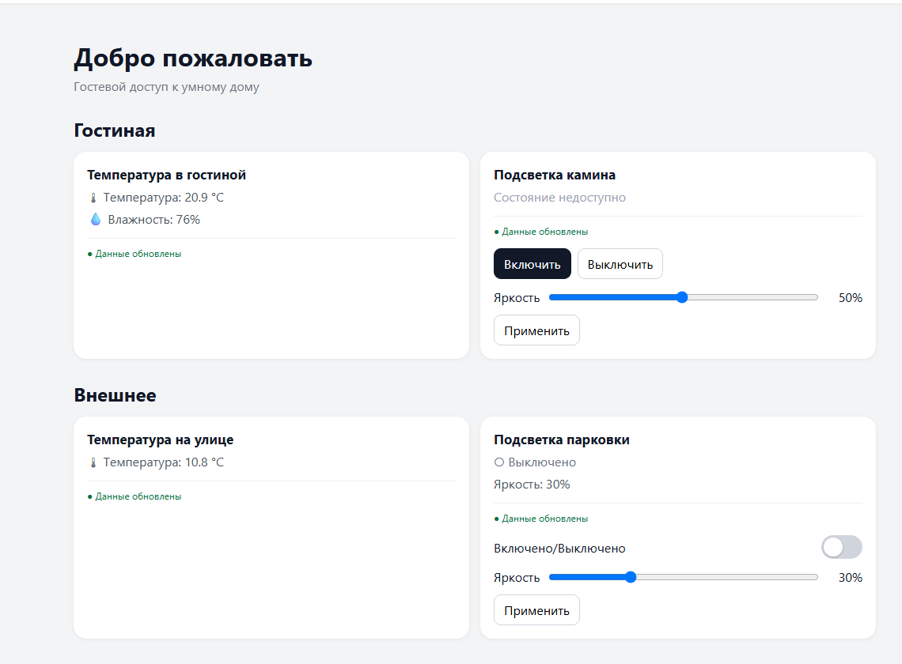
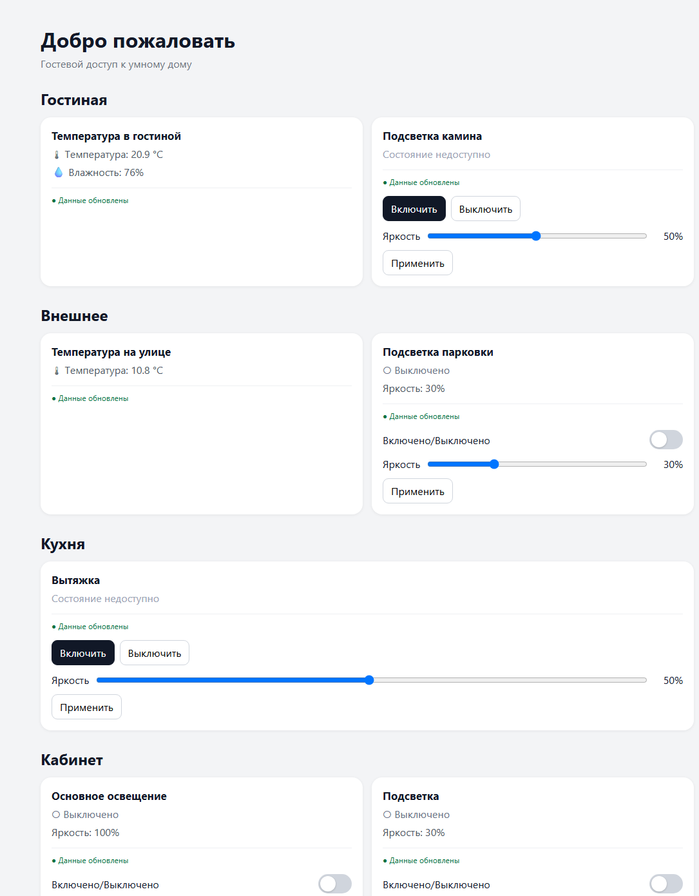
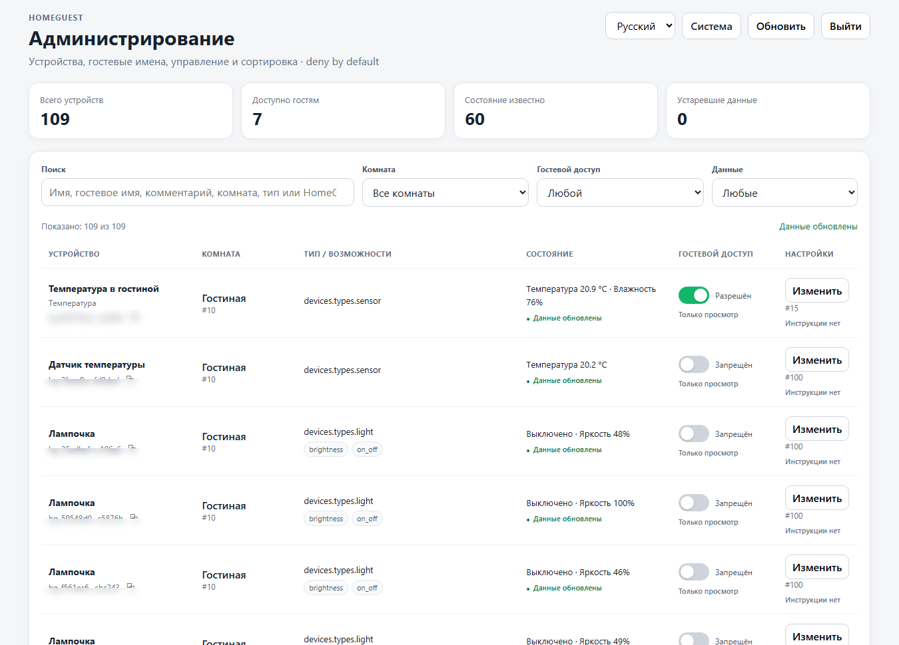
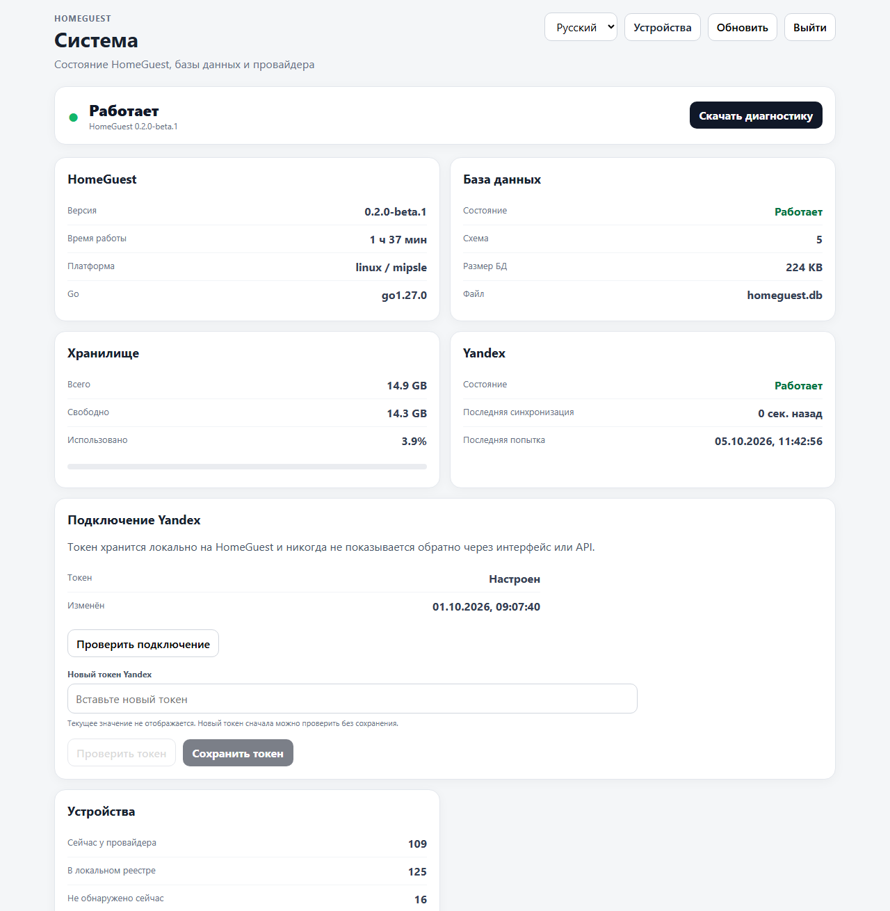
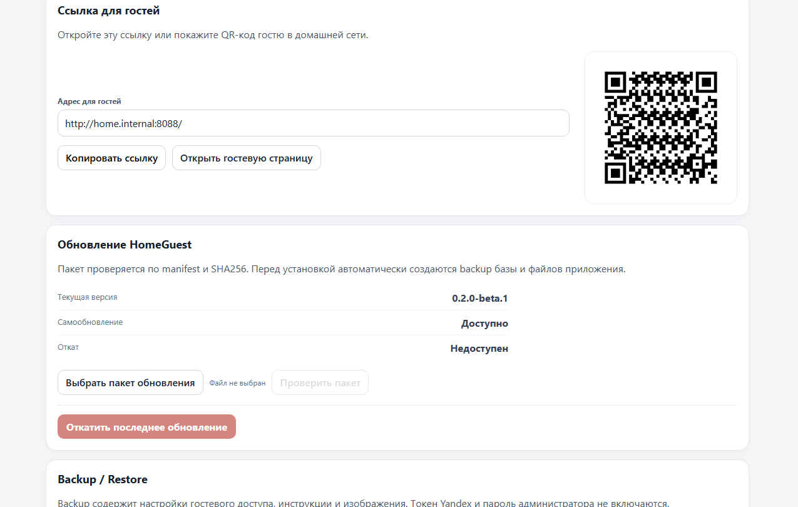

# HomeGuest

> **Умный дом, которым удобно пользоваться гостям.**

**HomeGuest** — локальное веб-приложение для домашней сети. Оно объединяет гостевые инструкции по дому и безопасный доступ к выбранным устройствам умного дома в одной простой веб-странице.

Текущая публичная версия: **0.4.0**

[**Скачать HomeGuest 0.4.0 для Keenetic**](https://github.com/ilinskiy/homeguest-releases/releases/download/v0.4.0/HomeGuest-0.4.0-Keenetic-Tester-Kit.zip) · [Описание релиза](https://github.com/ilinskiy/homeguest-releases/releases/tag/v0.4.0) · [Сообщить об ошибке](https://github.com/ilinskiy/homeguest-releases/issues/new/choose)

## Как выглядит HomeGuest

### Гостевая страница

Простой интерфейс для гостя: только разрешённые владельцем устройства, актуальные показания датчиков и понятные элементы управления.



<details>
<summary><strong>Показать больше комнат и устройств</strong></summary>

<br>



</details>

### Администрирование устройств

Владелец видит все устройства провайдера, их состояние и отдельно определяет, что именно будет доступно гостям.



### Состояние системы

Отдельная системная страница показывает версию HomeGuest, состояние базы данных, хранилища и подключения Yandex.



### Обновление, QR и резервные копии

HomeGuest умеет показывать гостевую ссылку и QR-код, проверять пакеты обновлений, создавать backup перед установкой и выполнять rollback.



---

## Зачем нужен HomeGuest

Когда в доме есть умные устройства, инструкции, Wi-Fi, телевизоры, освещение, датчики и разные правила, гостю часто приходится каждый раз объяснять одно и то же.

HomeGuest создаёт одну локальную страницу, где гость может:

- посмотреть инструкции по помещениям и оборудованию;
- увидеть правила дома;
- открыть полезные ссылки и изображения;
- посмотреть температуру и влажность;
- увидеть текущее состояние доступных устройств;
- управлять только теми устройствами, которые владелец разрешил показывать гостям.

Для владельца дома предусмотрена отдельная административная часть для настройки инструкций, устройств, доступа и состояния системы.

## Основные возможности

| Возможность | 0.4.0 |
|---|:---:|
| Гостевая веб-страница | ✅ |
| Инструкции по помещениям и оборудованию | ✅ |
| Изображения и ссылки в инструкциях | ✅ |
| Правила дома | ✅ |
| Интеграция с Yandex Smart Home | ✅ |
| Состояние устройств | ✅ |
| Температура и влажность | ✅ |
| Выбор устройств, доступных гостям | ✅ |
| Отдельные гостевые названия и комментарии | ✅ |
| Произвольные комнаты HomeGuest | ✅ |
| Произвольные устройства без Yandex | ✅ |
| QR-код гостевой страницы | ✅ |
| Мастер первоначальной настройки | ✅ |
| Backup / Restore | ✅ |
| Диагностика, health и readiness | ✅ |
| Автоматический перезапуск сервиса | ✅ |
| Защита от запуска нескольких экземпляров | ✅ |
| Проверка update package | ✅ |
| Backup перед обновлением | ✅ |
| Обновление и rollback | ✅ |
| Гостевые сценарии | ✅ |
| Несколько действий в одном сценарии | ✅ |
| Предварительная проверка прав сценария | ✅ |
| Голосовые сообщения через Яндекс Станции | ✅ |
| Выбор разрешённой колонки гостем | ✅ |
| ACL для голосовых сообщений | ✅ |
| Текстовое объявление для гостей | ✅ |

## Как это работает

HomeGuest устанавливается на устройство в домашней сети. В текущей beta основной целевой платформой является **Keenetic с Entware / OPKG**.

После установки владелец проходит мастер первоначальной настройки, задаёт пароль администратора и подключает Yandex Smart Home.

Гости открывают локальную страницу HomeGuest со смартфона или компьютера, подключённого к домашней сети. Для удобства адрес гостевой страницы можно показать в виде QR-кода.

## Быстрый старт

### 1. Скачать

Для первой установки скачайте готовый комплект:

**[HomeGuest-0.4.0-Keenetic-Tester-Kit.zip](https://github.com/ilinskiy/homeguest-releases/releases/download/v0.4.0/HomeGuest-0.4.0-Keenetic-Tester-Kit.zip)**

SHA256:

```text
A7D1BC1F3B17619498C89ABF736D47F8A9E6B9937FF94D2DBA6F21B61D9FDD81
```

### 2. Прочитать инструкцию

После распаковки начните с:

```text
README-FIRST.md
```

Затем следуйте:

```text
INSTALL-KEENETIC.md
```

В комплект также входят:

- `TEST-CHECKLIST.md` — чек-лист beta-тестирования;
- `REPORT-BUG.md` — шаблон отчёта об ошибке;
- release notes и контрольные суммы.

### 3. Установить и настроить

После установки откройте HomeGuest в браузере и пройдите мастер первоначальной настройки:

- создайте пароль администратора;
- укажите Yandex token;
- проверьте подключение;
- завершите настройку;
- настройте гостевые инструкции, произвольные комнаты и доступные устройства.

## Совместимость

Публичная версия 0.4.0 сейчас распространяется для следующей платформы:

| Платформа | Архитектура | Статус |
|---|---|---|
| Keenetic + Entware / OPKG | Linux MIPSLE softfloat | **Публичное beta-тестирование** |
| Linux amd64 | amd64 | Сборка тестируется внутри проекта |
| Linux arm64 | arm64 | Сборка тестируется внутри проекта |
| Windows | amd64 | Сборка тестируется внутри проекта |

На этом этапе **официально выдаём внешним тестерам только Keenetic MIPSLE softfloat**. Матрица конкретных моделей Keenetic будет расширяться по результатам реальных установок.

## Beta-тестирование

Сейчас особенно полезны тесты на разных моделях Keenetic.

Если HomeGuest у вас установился и работает, сообщите в Issues:

- модель Keenetic;
- версию KeeneticOS;
- архитектуру устройства, если известна;
- результат установки;
- работоспособность Yandex Smart Home;
- работоспособность гостевой страницы;
- замечания по интерфейсу и инструкции.

Если нашли ошибку, используйте готовый шаблон:

**[Создать Bug Report](https://github.com/ilinskiy/homeguest-releases/issues/new/choose)**

## Что уже проверено в 0.4.0

Перед публичным выпуском 0.4.0 были проверены:

- локальные Go tests;
- `go vet`;
- сборка MIPSLE softfloat;
- установка на реальный Keenetic;
- чистая первоначальная настройка;
- подключение Yandex Smart Home;
- загрузка устройств;
- защита single-instance;
- автоматический restart после аварийной остановки;
- проверка пакета обновления;
- backup перед обновлением;
- self-update;
- rollback;
- миграция beta.1 → beta.2;
- ручные комнаты и устройства;
- Backup / Restore ручных данных;
- локальные сценарии HomeGuest;
- сценарий «Включить + Яркость 35%»;
- запрет guest control;
- atomic preflight сценария;
- обновление 0.2.0-beta.2 → 0.3.0 на реальном Keenetic;
- голосовые сообщения через Яндекс Станции;
- выбор разных разрешённых колонок гостем;
- ACL guest visibility / guest control для колонок;
- серверный запрет отправки на недоступную колонку;
- health/readiness и проверка базы данных.

Подробнее: [RELEASE-NOTES-0.4.0.md](RELEASE-NOTES-0.4.0.md)

## Безопасность

HomeGuest находится в стадии beta-тестирования.

Перед установкой новой версии или экспериментами с обновлением рекомендуется сделать резервную копию.

При публикации Issues и логов **никогда не отправляйте**:

- Yandex OAuth token;
- пароль администратора HomeGuest;
- содержимое `data/secrets`;
- cookie или другие данные авторизации;
- другие пароли, ключи и персональные данные.

Если прикладываете журнал работы, сначала проверьте и обезличьте его.

## Релизы

Все публичные сборки находятся в разделе **[Releases](https://github.com/ilinskiy/homeguest-releases/releases)**.

Текущий релиз:

**[HomeGuest 0.4.0 — Public Beta for Keenetic](https://github.com/ilinskiy/homeguest-releases/releases/tag/v0.4.0)**

История изменений: [CHANGELOG.md](CHANGELOG.md)

## О репозитории

Этот публичный репозиторий используется для:

- публикации релизов HomeGuest;
- документации для пользователей и beta-тестеров;
- changelog;
- сбора bug reports и обратной связи.

Исходный код HomeGuest в этом репозитории **не публикуется**.

## Лицензирование и будущие версии

На этапе beta-тестирования HomeGuest распространяется для тестирования.

Коммерческие условия и модель лицензирования будут опубликованы до стабильного выпуска. Публичные beta-релизы и история изменений останутся доступны в этом репозитории.

---

**HomeGuest 0.4.0** · Public Beta · 2026

Copyright © 2026 HomeGuest. All rights reserved.
